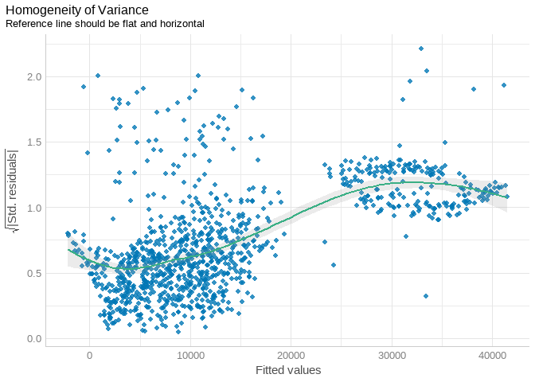
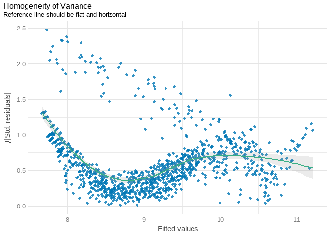
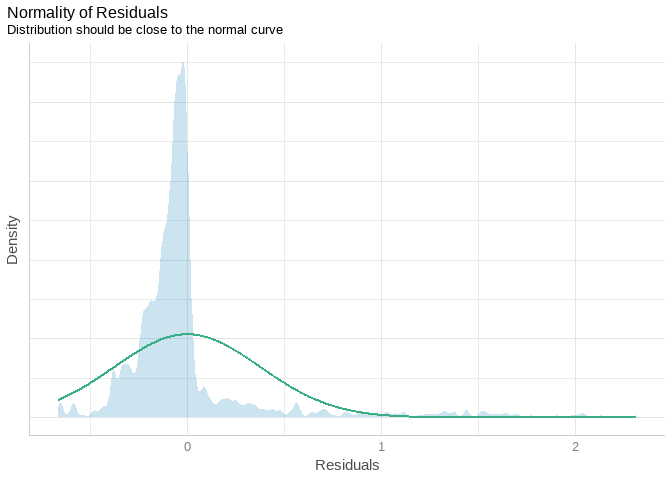

Predicting Insurance Premiums using Linear Regression
================

# INSURANCE EXPENSES PREDICTION

### Problem statement:

According to the International Monetary Fund (IMF) working paper titled
“Insurance Premiums: Determinants and Policy Implications,” there are
several challenges that insurance companies face when determining
insurance premiums. Insurance companies must assess the risk of an
insurance event occurring for each policyholder, taking into account a
wide range of factors such as the policyholder’s age, gender, medical
history, and the type and cost of coverage. This can be a complex and
time-consuming process.

Adverse selection is considered one of the major risks facing the
insurance sector. This is where an applicant gains insurance at a

cost that is below their true level of risk due to important variables
not being taken into consideration while computing the premiums.

### Main Objective:

The goal of this project is to build a predictive model that can
accurately (more than 85% accuracy)estimate insurance premiums based on
a variety of input features. **Thereafter, a PlumberApi for the model
will be created to serve predictions in a production enviroment.**

### Metric for Success:

The project will be considered a success if the predictive model is able
to explain not less than 80% of the variation of the target variable and
have a Mean Absolute Percentage Error (MAPE) of not more than 10%.

### DATA UNDERSTANDING

The data set to be used from Kaggle comprises of 1338 rows and 7
columns. This includes 4 numerical and 3 cotegorical features which will
be useful in selecting the target and predictor variables in this
analysis.

1.  age - This is the age of an individual in years
2.  bmi - This is the body mass index of an individual
3.  children - This indicates the number of dependents covered by the
    health insurance
4.  smoker - This describes whether an individual is a smoker or
    non-smoker (yes=smoker and no=non-smoker)
5.  region - This describes the beneficiary’s residential area in the
    USA
6.  expenses - This is the individual’s medical costs billed by health
    insurance

``` r
# importing the required libraries 

library(tidyverse)
library(janitor)
library(dlookr)
library(MLmetrics)
library(performance)
library(flextable)
library(caret)
```

``` r
# reading in the data 

df <- read_csv("Insurancedata.csv")
```

``` r
# checking the first few rows of the dataset 

df %>% head()
```

    ## # A tibble: 6 x 7
    ##     age sex      bmi children smoker region    expenses
    ##   <dbl> <chr>  <dbl>    <dbl> <chr>  <chr>        <dbl>
    ## 1    19 female  27.9        0 yes    southwest   16885.
    ## 2    18 male    33.8        1 no     southeast    1726.
    ## 3    28 male    33          3 no     southeast    4449.
    ## 4    33 male    22.7        0 no     northwest   21984.
    ## 5    32 male    28.9        0 no     northwest    3867.
    ## 6    31 female  25.7        0 no     southeast    3757.

``` r
# checking the last few rows of the dataset 

df %>% tail()
```

    ## # A tibble: 6 x 7
    ##     age sex      bmi children smoker region    expenses
    ##   <dbl> <chr>  <dbl>    <dbl> <chr>  <chr>        <dbl>
    ## 1    52 female  44.7        3 no     southwest   11412.
    ## 2    50 male    31          3 no     northwest   10601.
    ## 3    18 female  31.9        0 no     northeast    2206.
    ## 4    18 female  36.9        0 no     southeast    1630.
    ## 5    21 female  25.8        0 no     southwest    2008.
    ## 6    61 female  29.1        0 yes    northwest   29141.

### DATA CLEANING AND WRANGLING

For data cleaning, data will be checked for the following:

- Missing values

- duplicated values

``` r
# checking duplicated values in the dataset 

df %>% duplicated() %>% sum()
```

    ## [1] 1

It appears as they there is one duplicated values which will be removed
from the dataset

``` r
# removing duplicated record 

df <- df %>% distinct()
```

``` r
# checking missing values 

df %>% describe() %>% select(described_variables, na)
```

    ## # A tibble: 4 x 2
    ##   described_variables    na
    ##   <chr>               <int>
    ## 1 age                     0
    ## 2 bmi                     0
    ## 3 children                0
    ## 4 expenses                0

There are no missing values in the dataset

``` r
# checking categories 

df %>% diagnose_category()
```

    ## # A tibble: 8 x 6
    ##   variables levels        N  freq ratio  rank
    ##   <chr>     <chr>     <int> <int> <dbl> <int>
    ## 1 sex       male       1337   675  50.5     1
    ## 2 sex       female     1337   662  49.5     2
    ## 3 smoker    no         1337  1063  79.5     1
    ## 4 smoker    yes        1337   274  20.5     2
    ## 5 region    southeast  1337   364  27.2     1
    ## 6 region    southwest  1337   325  24.3     2
    ## 7 region    northeast  1337   324  24.2     3
    ## 8 region    northwest  1337   324  24.2     3

``` r
# checking numeric variables 

df %>% diagnose_numeric()
```

    ## # A tibble: 4 x 10
    ##   variables   min     Q1     mean median      Q3     max  zero minus outlier
    ##   <chr>     <dbl>  <dbl>    <dbl>  <dbl>   <dbl>   <dbl> <int> <int>   <int>
    ## 1 age         18    27      39.2    39      51      64       0     0       0
    ## 2 bmi         16    26.3    30.7    30.4    34.7    53.1     0     0       9
    ## 3 children     0     0       1.10    1       2       5     573     0       0
    ## 4 expenses  1122. 4746.  13279.   9386.  16658.  63770.      0     0     139

``` r
# checking for outliers 

df %>% diagnose_outlier()
```

    ## # A tibble: 4 x 6
    ##   variables outliers_cnt outliers_ratio outliers_mean with_mean without_mean
    ##   <chr>            <int>          <dbl>         <dbl>     <dbl>        <dbl>
    ## 1 age                  0          0             NaN       39.2         39.2 
    ## 2 bmi                  9          0.673          49.3     30.7         30.5 
    ## 3 children             0          0             NaN        1.10         1.10
    ## 4 expenses           139         10.4         42104.   13279.        9935.

Although there is evidence of outliers, they don’t seem to have such a
great effect on the mean so they will be no need to remove them unless
they affect our regression model

### EXPLORATORY DATA ANALYSIS

#### Univariate analysis

``` r
ggplot(df, aes(age))+
  geom_histogram(fill='blue', bins = 10)
```

<!-- -->

``` r
ggplot(df, aes(bmi))+
  geom_histogram(fill='yellow',bins = 10)
```

<!-- -->

``` r
ggplot(df, aes(expenses))+
  geom_histogram(fill='lightgreen', bins = 10)
```

<!-- -->

``` r
ggplot(df, aes(region, fill=region))+
  geom_bar()
```

<!-- -->

The graph above indicates the insurance premium means for each region.
Individuals in the Southeast region make a higher contribution of about
USD 14,500 while individuals in the Southwest region make contributions
of USD 12,000.

``` r
ggplot(df,aes(sex, fill=sex))+
  geom_bar()
```

<!-- -->

From the above barplot, it looks like both gender are well represented
in the dataset

``` r
ggplot(df, aes(age, expenses, fill=smoker))+
  geom_point(color='grey')+
  geom_smooth()
```

    ## `geom_smooth()` using method = 'gam' and formula = 'y ~ s(x, bs = "cs")'

<!-- -->

From the scatter plot above, it can be noted that the expenses billed to
both smokers and non-smokers increases as age increases. However, the
expenses on non-smokers are much lower than those of individuals who
smoke. The increment in expenses could be as a result of deteriorating
health with age plus the health risks associated with smoking.

``` r
ggplot(df, aes(bmi, expenses, fill=smoker))+
  geom_point(color='grey')+
  geom_smooth(method = 'lm')
```

    ## `geom_smooth()` using formula = 'y ~ x'

<!-- -->

The scatter plot above shows the relationship between BMI, smoker and
expenses . The plot shows that there is a positive relationship between
BMI and expenses, meaning that as BMI increases, expenses also increase.
Moreover, individuals with a high BMI who smoke incur the highest
expenses as shown above. This may also indicate that as the BMI
increases and an individual smokes, there is a higher risk of incurring
medical expenses, which would be in line with the insurance company’s
risk assessment process.

``` r
df %>% group_by(smoker) %>% summarise(average_expenses = mean(expenses)) %>% 
  ggplot(aes(smoker, average_expenses, fill=smoker))+
    geom_bar(stat = 'identity')
```

<!-- -->

``` r
df %>% group_by(region) %>% summarise(average_expenses = mean(expenses)) %>% 
  ggplot(aes(region, average_expenses, fill=region))+
    geom_bar(stat = 'identity')
```

<!-- -->

### MODELLING

A multiple linear regression model will be used to predict the amount a
customer should pay considering his or her age, location, smoking
status, BMI, gender an region

The model will be training iteratively from an initial model to a final
model.

#### Splitting data to a training and testing sets

First thing first, we are going to split the data into training and
testing sets

``` r
# splitting data to training and testing sets 

split <- createDataPartition(df$expenses, p=0.8, list = FALSE)

train_set <- df[split,]

test_set <- df[-split,]
```

#### Initial model

The initial model will include all the variables

``` r
# fitting an initial model 

initial_model <- lm(expenses ~., data = train_set)
initial_model %>% summary()
```

    ## 
    ## Call:
    ## lm(formula = expenses ~ ., data = train_set)
    ## 
    ## Residuals:
    ##      Min       1Q   Median       3Q      Max 
    ## -11508.1  -2816.8   -927.6   1628.7  29594.4 
    ## 
    ## Coefficients:
    ##                  Estimate Std. Error t value Pr(>|t|)    
    ## (Intercept)     -12510.73    1098.78 -11.386  < 2e-16 ***
    ## age                265.08      13.26  19.991  < 2e-16 ***
    ## sexmale             27.82     372.64   0.075  0.94049    
    ## bmi                345.39      31.87  10.837  < 2e-16 ***
    ## children           527.45     154.61   3.412  0.00067 ***
    ## smokeryes        24087.33     460.31  52.328  < 2e-16 ***
    ## regionnorthwest   -698.98     532.76  -1.312  0.18980    
    ## regionsoutheast  -1034.69     537.88  -1.924  0.05467 .  
    ## regionsouthwest  -1014.90     537.71  -1.887  0.05937 .  
    ## ---
    ## Signif. codes:  0 '***' 0.001 '**' 0.01 '*' 0.05 '.' 0.1 ' ' 1
    ## 
    ## Residual standard error: 6056 on 1063 degrees of freedom
    ## Multiple R-squared:  0.7593, Adjusted R-squared:  0.7575 
    ## F-statistic: 419.1 on 8 and 1063 DF,  p-value: < 2.2e-16

The model has an R-squared of `75%`

#### Model diangnostics for the initial model

- Checking heteroskedasticity

``` r
initial_model %>% check_heteroscedasticity() %>% plot()
```

<!-- -->

- Checking for normality of residuals

``` r
# checking for normality of residuals
initial_model %>% check_normality() %>% plot()
```

<!-- -->

- Checking for collinearity

``` r
# checking for multicollienarity

initial_model %>% check_collinearity()
```

    ## # Check for Multicollinearity
    ## 
    ## Low Correlation
    ## 
    ##      Term  VIF     VIF 95% CI Increased SE Tolerance Tolerance 95% CI
    ##       age 1.02 [1.00,   1.67]         1.01      0.98     [0.60, 1.00]
    ##       sex 1.01 [1.00,   1.93]         1.01      0.99     [0.52, 1.00]
    ##       bmi 1.12 [1.07,   1.23]         1.06      0.89     [0.82, 0.94]
    ##  children 1.00 [1.00, 879.86]         1.00      1.00     [0.00, 1.00]
    ##    smoker 1.02 [1.00,   1.62]         1.01      0.98     [0.62, 1.00]
    ##    region 1.12 [1.06,   1.22]         1.06      0.89     [0.82, 0.94]

- Checking for outliers

``` r
# checking for outliers 

initial_model %>% check_outliers() %>% plot()
```

<!-- -->

- Checking for the accuracy of the model using Mean Absolute Percentage
  Error

``` r
# Accuracy of the model 
MAPE(y_pred = initial_model$fitted.values, y_true = train_set$expenses)
```

    ## [1] 0.4133623

#### Second model

From the initial model, there seems to have some evidence of
heteroskedasticity as shown by the residual plots and the distribution
of the residuals

For the second model, the target variable expenses will be
log-transformed and include interaction terms between age and smoker and
BMI and smoker

``` r
# log transforming the target 

train_set2 <- train_set%>% mutate(log_exp = log(expenses)) %>% select(-expenses)
```

``` r
# fitting the second model with the log-transformed target and an interaction term included 

second_model <- lm(log_exp ~ age + sex + bmi + 
                     children +
                     smoker + 
                     region +
                     age * smoker +
                     bmi * smoker, data = train_set2)

second_model %>% summary()
```

    ## 
    ## Call:
    ## lm(formula = log_exp ~ age + sex + bmi + children + smoker + 
    ##     region + age * smoker + bmi * smoker, data = train_set2)
    ## 
    ## Residuals:
    ##      Min       1Q   Median       3Q      Max 
    ## -0.66470 -0.15189 -0.05953 -0.00509  2.31705 
    ## 
    ## Coefficients:
    ##                   Estimate Std. Error t value Pr(>|t|)    
    ## (Intercept)      7.0979570  0.0770119  92.167  < 2e-16 ***
    ## age              0.0416068  0.0009329  44.599  < 2e-16 ***
    ## sexmale         -0.0797521  0.0234430  -3.402 0.000694 ***
    ## bmi              0.0024407  0.0022449   1.087 0.277188    
    ## children         0.1060409  0.0097059  10.925  < 2e-16 ***
    ## smokeryes        1.3256024  0.1567744   8.455  < 2e-16 ***
    ## regionnorthwest -0.0838710  0.0334381  -2.508 0.012282 *  
    ## regionsoutheast -0.1603826  0.0337772  -4.748 2.33e-06 ***
    ## regionsouthwest -0.1597226  0.0337756  -4.729 2.56e-06 ***
    ## age:smokeryes   -0.0332051  0.0020629 -16.097  < 2e-16 ***
    ## bmi:smokeryes    0.0492452  0.0045256  10.882  < 2e-16 ***
    ## ---
    ## Signif. codes:  0 '***' 0.001 '**' 0.01 '*' 0.05 '.' 0.1 ' ' 1
    ## 
    ## Residual standard error: 0.3801 on 1061 degrees of freedom
    ## Multiple R-squared:  0.8317, Adjusted R-squared:  0.8301 
    ## F-statistic: 524.2 on 10 and 1061 DF,  p-value: < 2.2e-16

The second model has an R-squared of `82%` which is an improved from the
initial model

#### Model diangnostics for the second model

- Checking heteroskedasticity

``` r
second_model %>% check_heteroscedasticity() %>% plot()
```

<!-- -->

- Checking for normality of residuals

``` r
# checking for normality of residuals
second_model %>% check_normality() %>% plot()
```

<!-- -->

- Checking for outliers

``` r
# checking for outliers 

second_model %>% check_outliers() %>% plot()
```

<!-- -->

``` r
# checking the mean absolute percentage error 

MAPE(y_pred = second_model$fitted.values, y_true = train_set2$log_exp)
```

    ## [1] 0.02244761

This shows that the second model is better than the first model as it
has more superior R-squared and Mean Absolute Percentage Error.

##### Testing the performance of the model on new unseen data

``` r
# testing model on new unseen data 

test_set2 <- test_set%>% mutate(log_exp = log(expenses)) %>% select(-expenses)

y_test_pred = predict(second_model, newdata = test_set2)

MAPE(y_test_pred, test_set2$log_exp)
```

    ## [1] 0.02368342

According to the Mean Absolute Percentage Error, the ultimate model will
have an expected error of about `2.5 percent` on every prediction it
makes which is pretty impressive

### SAVING THE MODEL INTO A RDS OBJECT

``` r
# saving the model 

write_rds(second_model,"insurance_model.rds")
```

### RECOMMENDATIONS

1.The company should consider implementing a higher premium for smokers,
as the data indicates that they have a higher expected expense.

2.The company should also take into account the number of children when
setting premiums, as this variable had a positive correlation with
expenses.

3.The company can also consider offering discounted premiums for
policyholders from the SouthWest and Northwest regions, as they had
lower expected expenses compared to those from the SouthEast region.

4.The company should also consider collecting more data on other factors
such as medical conditions, previous claims, lifestyle, and occupation
to improve the accuracy of their pricing model.

5.The company can also consider offering discounts for individuals who
maintain a healthy BMI, as this variable was negatively correlated with
expenses.

6.The company should also consider the age of a policyholder when
setting premiums, as this variable had a positive correlation with
expenses.

7.The company should also consider the policyholders sex when setting
premiums, as this variable had a positive correlation with expenses for
males.

8.Finally, the company should consider using the developed model as a
guide for pricing premiums, as it had a low MAPE of 10% which indicates
that it is a good model for predicting expenses.
